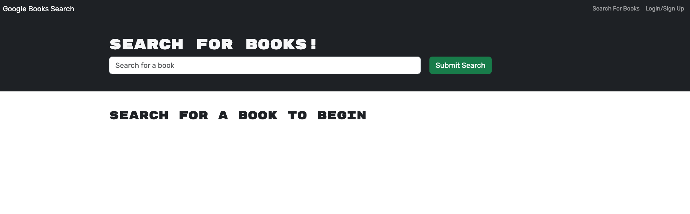
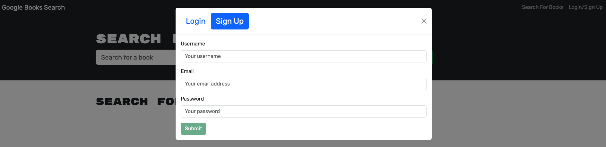
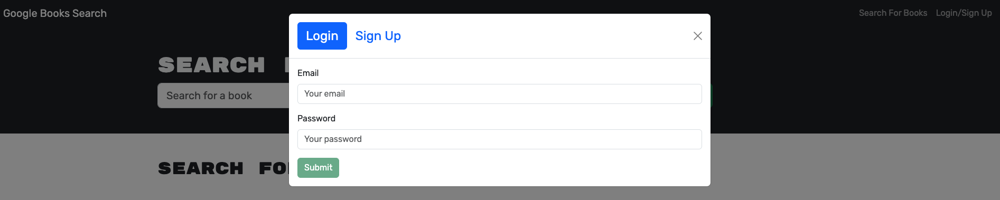
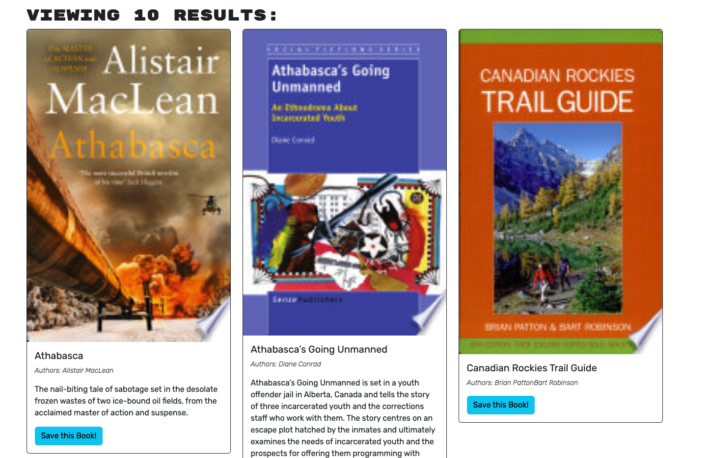
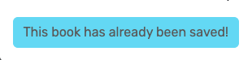
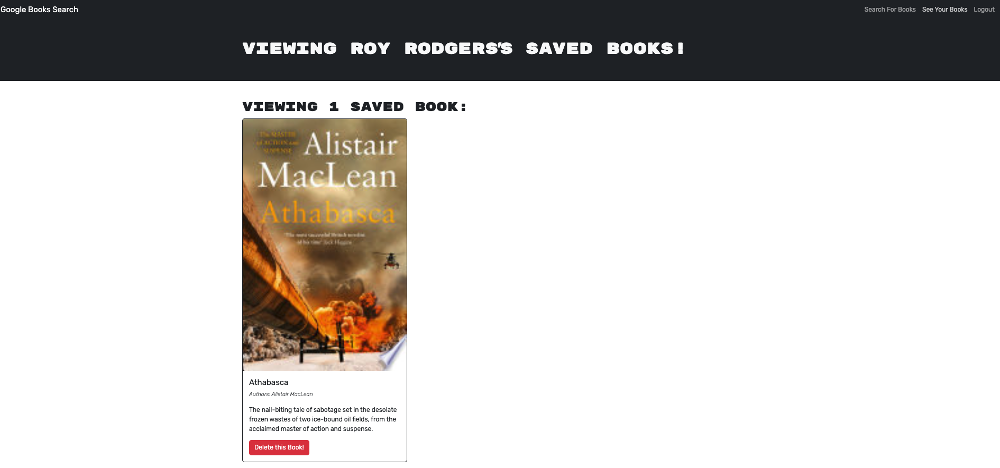

# Rainy Days: A Reading List

## Description

This is a website where a user can search for books to read and save them to their list when they have created an account and logged in.

## Table of Contents

- [Installation](#installation)
- [Usage](#usage)
- [Credits](#credits)
- [License](#license)
- [Contributing](#contributing)
- [Tests](#tests)
- [Questions](#questions)

## Installation

To use the project, visit the website at this [link](https://rainy-days-jufn.onrender.com/saved)!

## Usage

Once at the website, you'll see this page.

You can search books to view all you'd like on this page, but you won't be able to save them unless you create an account and/or login first.

Creating an account is easy as a first time user. Simply click on the "Login/Sign Up" link in the navbar and then select the "Sign Up" button. 

Enter a username, email, and password and click on "Submit". If there was an issue, you'll see a red error box indicating this. Just try a different email or password. 

Now, to login again in the future, you just have to click on the same "Login/Sign Up" link in the navbar and select "Login" where you'll enter the email and password for your account.

Once you are signed up and logged in, you can search books and save them! 

When you're done looking at your list, click on the "Logout" button and you'll be logged out of your account.

In my example, I searched for "Athabasca" by Alistair MacLean. Once I found the book, I clicked on the "Save this Book!" button to add it to my list. 

Once the book was added to my list, the button changes to a message informing me that this book has already been saved so that I don't attempt to add it to my list again.

Going to the navbar, I then clicked on "See Your Books" to navigate to the page where my saved books are displayed. Here, I could see the book I had saved with its information and a button to delete it if I want. My username is also displayed as part of the page title and the number of books I have saved is displayed so that I can see how much reading I have to catch up on!

That's pretty much the bulk of the functionality. As always, feel free to play around with the site and make sure to report any bugs!

## Credits

- The books icon for the browser tab was sourced from [Flaticon](https://www.flaticon.com/) and [was created by popo2021](https://www.flaticon.com/free-icons/library).
- The starter files for this project were supplied by edX Boot Camps LLC

## License

Licensed under the [MIT](./LICENSE) license.

## Contributing

This project has no contribution guidelines.

## Tests

There are no test instructions developed for this project.

## Questions

- GitHub: [Johngoldade](https://github.com/Johngoldade)
- Email: [goldade.john@gmail.com](mailto:goldade.john@gmail.com)

To ask further questions, reach out to me at the above email and I will get back to you as soon as I can.